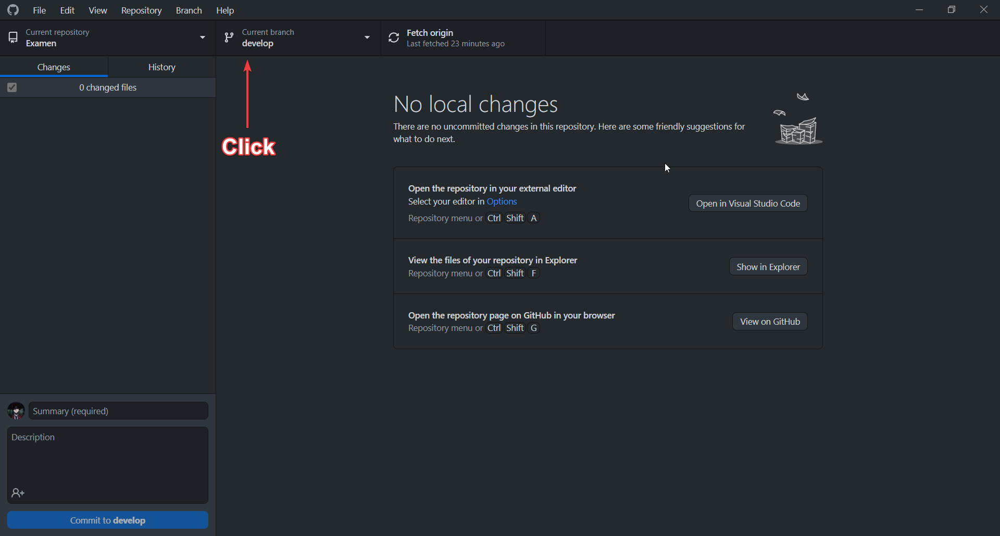
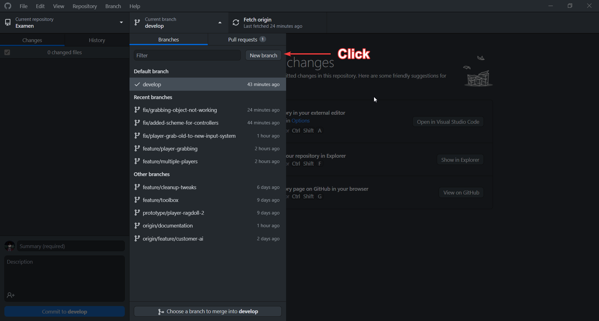

# GitHub Desktop

## Create Branch

1. Open Github Desktop on your computer.
2. Click on the "current branch" button located at the top of the interface.
3. A pop-up window will appear, presenting a list of branches available for your project. In that popup, switch to the develop branch to ensure that you create a new branch from the develop branch.
4. Click on the "new branch" button located at the top right of the pop-up window.
5. In the new pop-up window, give your new branch an appropriate branch type and name and select "develop" as the base branch for your new branch. If you switched to the develop branch before clicking the new branch, you can skip this step.
6. Click on the "create branch" button to complete the process.
7. GitHub Desktop will automatically switch to your new branch and allow you to start working on it.
8. When you are ready to publish your changes to the remote repository, click on the "publish branch" button located next to the "current branch" button.

<figure><figcaption></figcaption></figure>

<figure><figcaption></figcaption></figure>

When you clicked 'create branch' when you were not on the develop branch you see the following popup make sure to select the 'develop' branch before you click the create branch button&#x20;

&#x20;

When you clicked 'create branch' and you where already on the develop branch you don't have to do anything since it will automatically be from the develop branch.

## Commit changes

## Create pull request&#x20;

