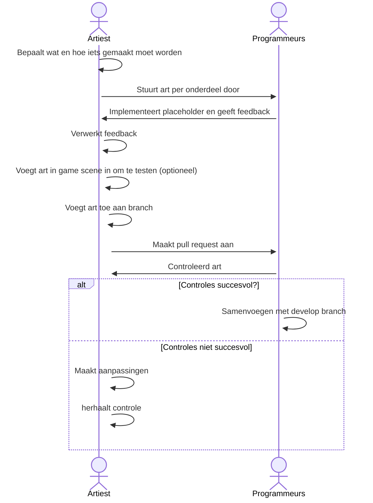
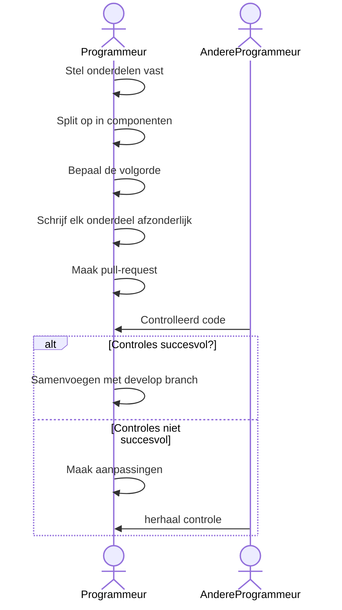
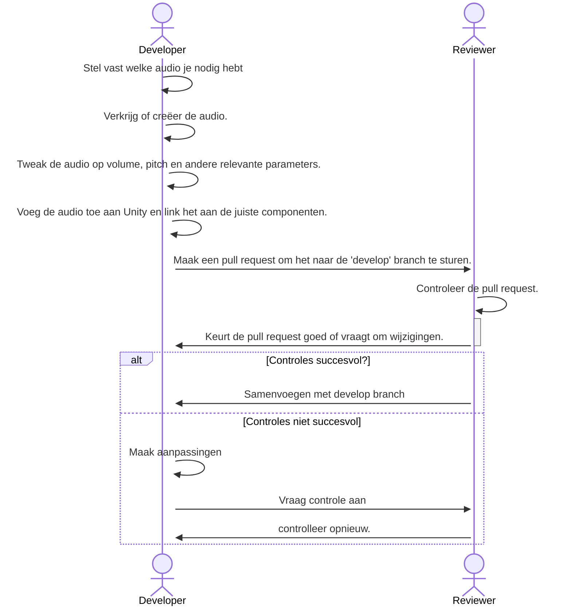

# Pipeline

## Art

Voor de ontwikkeling van so called “art” onderdelen word de volgende pipeline aangehouden voor het aanmaken en het toevoegen

#### Onderdelen:

1. 3D-modellen, inclusief alle bijbehorende componenten, zoals textures, animaties en andere elementen
2. 2D sprites, bestaande uit alle 2D-elementen, zoals textures, characters, sprites, en animaties in sprite-sheet formaat.
3. Effecten, waaronder alle soorten effecten, zoals particle systems, SFX en shaders.

#### Volgorde:

1. De artiest bekijkt de trello om te kijken wat er gemaakt moet worden en kiest vervolgens in welke volgorde het gemaakt word in general word de volgende software en order aangehouden maar kan anders indien nodig.
   * 3D Modellen
     * Model: Blender
     * Rig: Blender
     * Animaties: Blender
     * Textures: Substance painter
   * 2D sprites
     * Sprite: ClipStudio
     * Animaties: ClipStudio alternative adobe animate
     * indien mogelijk spritesheet maken van alle sprites
   * Effecten
     * Shader: Unity ShaderGraph or Unity Amplify
     * Particles: Unity particle system
2. De artiest bepaald in welke volgorde het gemaakt moet worden in general word de volgende volgorde gebruikt:
   * 3D Modellen
     * Model
     * uv
     * rig
     * weightpaint
     * texture
     * animate
   * 2D sprites
     * Sprite
     * Spritesheet (voor animatie)
   * Effecten
     * Sprite
     * Spritesheet (voor animatie)
3. De artiest maakt de art in de bedachte of general volgorde en indien nodig stuurt deze individual door, zodat het mogelijk als placeholder kan worden gebruikt door de andere developers. ook is er mogelijkheid voor feedback indien dat er is.
4. Nadat de art klaar is, kan er een branch worden aangemaakt op GitHub. Hierbij wordt de gitflow-methode aangehouden en wordt de art toegevoegd. Als de artiest weet hoe, kan de art ook meteen in de game scene worden verwerkt. Anders wordt het later gedaan door iemand met ervaring. Als het kleine bestanden zijn, kan het rechtstreeks naar een andere ontwikkelaar worden gestuurd en kan het direct in de feature branch worden gebruikt.
5. Ongeacht of de art al in de game verwerkt zit of alleen in de game folders, kan er een pull request worden aangemaakt om het naar de develop branch te mergen. Iemand met ervaring kan later een branch maken om het toe te voegen aan de game als dat nog niet is gebeurd of als het niet is gelukt.
6. De pull request wordt gecontroleerd in een review, waarbij het volgende wordt gecheckt:
   * Past de art bij de rest van de game?
   * Is de grootte van de art-bestanden niet onnodig groot?
   * Is de naamgevingsconventie van de art correct? (kan gevonden worden in de naming conventie wiki)
   * Is de art op de juiste plek in de mappenstructuur geplaatst? (kan gevonden worden in de naming conventie wiki)
   * Is de art compleet? Kan het worden gebruikt of ontbreekt er iets cruciaals?
   * Werkt de transparantie indien aanwezig
   * Is de file type correct (3d model: fbx) (sprite / texture: png)
7. Als de pull request is goedgekeurd, kan het worden gemerged naar de ontwikkelomgeving door iemand met ervaring om merge-fouten te voorkomen. Als de pull request niet is goedgekeurd, moet de gegeven feedback worden verwerkt of met overleg worden genegeerd. Vervolgens moet de art worden gepusht en gecontroleerd en worden de stappen herhaald.

## Scripts

Voor de ontwikkeling van de volgende onderdelen wordt de volgende pipeline gebruikt. Alles na punt 4 is echter alleen van toepassing op het samenvoegen naar de 'develop' branch. De 'develop' branch mag worden samengevoegd met alle andere branches, maar alle andere branches mogen niet worden samengevoegd met andere branches of subbranches krijgen.

#### Onderdelen:

1. User Interface (UI): Dit omvat alle aspecten van de interface waarmee de gebruiker interactie heeft, zoals menu's, knoppen, lay-outs, tekst en feedback voor acties.
2. Game Mechanics: Dit omvat alle regels, systemen en mechanismen die de gameplay definiëren, zoals beweging, physics, AI, score tracking en progressie, sound player.
3. Tools: zijn programma's of hulpmiddelen die gebruikt worden om het spel te maken of aan te passen. Dit omvat bijvoorbeeld route- en kaartmakers, scriptingtools, texture en model editors, enzovoort.

#### Volgorde:

1. De programmeur stelt vast welke onderdelen er gemaakt moeten worden door te kijken naar de verschillende ToDo's op de Trello en splitst deze op in afzonderlijke componenten. Dit wordt gedaan om de pull-request relatief klein te houden en om beter na te denken over het single responsibility principle. Indien nodig kan er overleg plaatsvinden over het opsplitsen van de componenten.
2. De programmeur bepaalt de volgorde waarin de onderdelen worden gemaakt, rekening houdend met scriptverbindingen. Een voorbeeld hiervan kan zijn (als de mapDrawer de locatie van de user nodig heeft schrijf je dus eerst de gps components)
3. De programmeur schrijft elk onderdeel afzonderlijk. Deze onderdelen worden geschreven in Jetbrains Rider. Zodra een onderdeel klaar is, wordt er een pull-request van gemaakt. Dit wordt gecontroleerd door een andere programmeur die er niet of het minst aan heeft gewerkt. Er wordt gekeken naar de volgende onderdelen:
   * Conventies voor benaming
   * Leesbaarheid
   * Single responsibility
4. Zodra alles is gecontroleerd, wordt de pull-request goedgekeurd of worden er wijzigingen aangevraagd die moeten worden aangebracht voordat het kan worden goedgekeurd.
5. Als de pull-request is goedgekeurd, kan deze worden samengevoegd met de develop branch. Als de request niet is goedgekeurd, wordt het proces vanaf stap 4 herhaald nadat de wijzigingen zijn aangebracht.

## Sound & Audio

#### Onderdelen

1. Environment: Dit omvat passende omgevingsgeluiden, zoals bijvoorbeeld stadsgeluiden, natuurlijke omgevingsgeluiden (bijvoorbeeld vogelgezang, waterstromen, regen), machinegeluiden, weersomstandigheden (bijvoorbeeld onweer), enzovoort.
2. Interactie: Dit omvat gepaste interactiegeluiden voor bijvoorbeeld het oppakken van voorwerpen, schieten, het openen en sluiten van deuren, voetstappen, enzovoort.
3. Interface UI: Dit omvat passende interfacegeluiden zoals bijvoorbeeld het klikken op knoppen, het selecteren van items, notificatiegeluiden, enzovoort.

#### Volgorde:

1. Kijk naar de Trello om te zien welke feature welke audio nodig heeft.
2. Verkrijg de audio doormiddel van online clips op te zoeken of maak deze zelf met een microfoon in een stille ruimte om zo zuiver mogelijke audio te krijgen.
3. Tweak de audio op volume, pitch (bijvoorbeeld: toonhoogte), en andere relevante parameters. En zo nodig audio clips splitst. Deze dingen worden gedaan in het programma Audacity
4. Voeg de audio toe aan Unity en link het aan de juiste componenten.
5. Maak een pull request om het naar de 'develop' branch te sturen.
6.  Controleer de pull request, waarbij het volgende wordt gecontroleerd:

    * Klinkt de audio goed? en hoe is de samenhang met andere audio.
    * Wordt de audio op passende wijze weergegeven, afhankelijk van het type geluid en de context waarin het wordt gebruikt, en is de balans tussen verschillende geluiden binnen de game evenwichtig?
    * Grootte van de audio (geen exact getal, maar controleer of het niet onnodig groot is)
    * Zijn de verwijzingen naar de componenten correct?
    * Mocht de audio tekst bevatten klopt de tekst en past de tekst bij de rest van de game / app
    * Controleer of de audio aan de naming convention voldoet

    hierbij is het belangerijk om te weten dat connecties tussen componenten, file size en andere dingen gericht op hardware of code door een programmeur of iemand met ervaring word gecontrolleerd. Daar in tegen kan het geluid van de audio door iedereen worden gecontroleerd zolang die persoon niet toondoof is.
7. Als de pull request is goedgekeurd, kan deze worden gemerged met de 'develop' branch. Als de pull request niet wordt goedgekeurd, dienen de gegeven feedbackpunten te worden verwerkt en moet de 'controleprocedure' opnieuw worden uitgevoerd.

