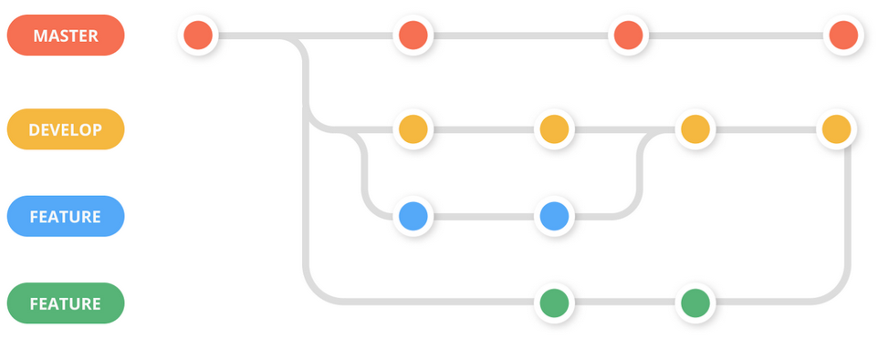

# Gitflow

<figure><figcaption></figcaption></figure>

In this section, we will detail how we managed our GitHub repository, including the conventions we followed and the steps we took for specific actions such as creating a new branch or committing our work.&#x20;

### Flow

this is the general flow we used. there might be some rare instances where it is slightly off but that is not expected &#x20;

1. Create a branch for your feature, fix or import from the develop branch
2. try to commit your work frequently to prevent lost work!
3. try to push your work at least once a day preferably at the end of the day so the most recent changes are on the remote.
4. if you are finished with **all** your work merge the develop branch into your branch
5. check if everything is still working if everything works continue to the next step if not fix that what is not working and commit + push it and then continue to the next step
6. create a pull request to merge your work into the develop branch
7. wait for someone else to validate your pull request if there are no changes needed the branch will be merged and deleted if there are changes needed do that and push those changes and the pull-request will be again be validated.

## Conventions

<table data-view="cards"><thead><tr><th></th><th></th><th></th><th data-hidden data-card-target data-type="content-ref"></th></tr></thead><tbody><tr><td></td><td><strong>Branch Types</strong> what types do we use or can we use </td><td></td><td><a href="conventions/branch-types.md">branch-types.md</a></td></tr><tr><td></td><td><strong>Branch Naming</strong> how do we name our branches</td><td></td><td><a href="conventions/branch-naming.md">branch-naming.md</a></td></tr><tr><td></td><td><strong>Commiting</strong> how do we create a good title and description</td><td></td><td><a href="conventions/commiting.md">commiting.md</a></td></tr></tbody></table>

## How To's&#x20;

All software we used to manage GitHub note that this is just the basics of how to use it and explain only what we use to manage GitHub itself not the things we can do locally like stashing and or discarding.

<table data-view="cards"><thead><tr><th></th><th></th><th></th><th data-hidden data-card-target data-type="content-ref"></th></tr></thead><tbody><tr><td></td><td><strong>GitHub Desktop</strong> how do we use GitHub Desktop</td><td></td><td><a href="how-tos/github-desktop.md">github-desktop.md</a></td></tr></tbody></table>

