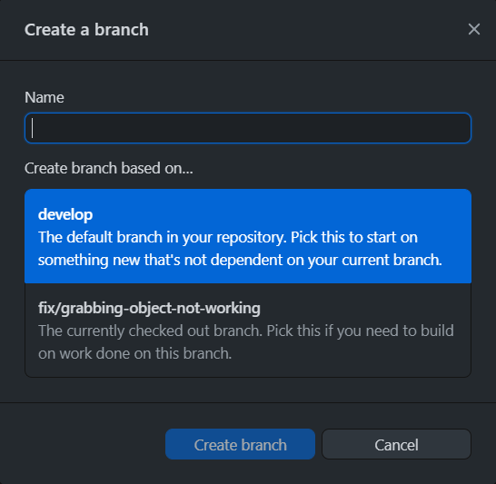
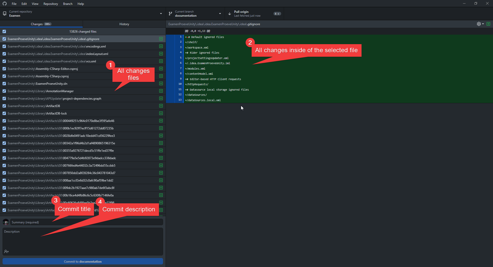
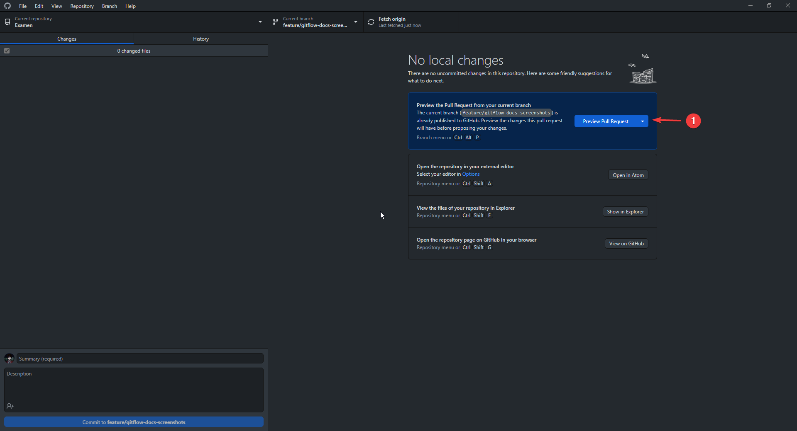
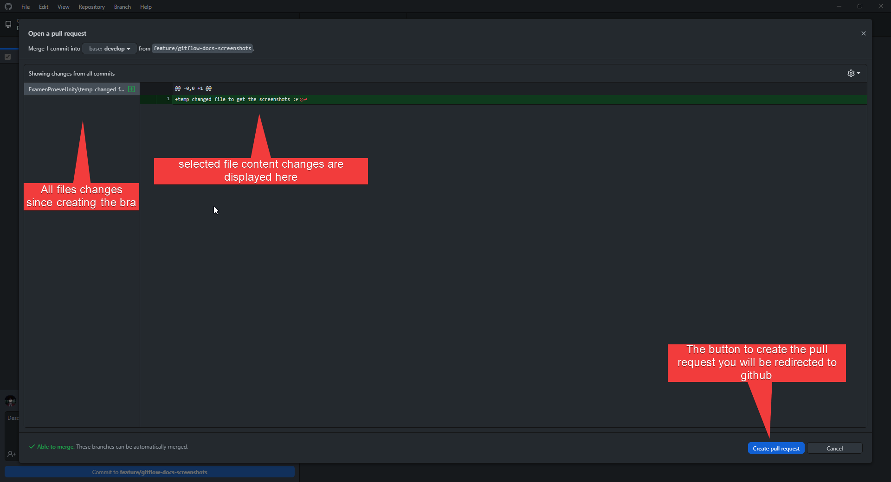

# GitHub Desktop

## Create Branch

<figure><figcaption></figcaption></figure>

1. Open Github Desktop on your computer.
2. Click on the "current branch" button located at the top of the interface.
3. A pop-up window will appear, presenting a list of branches available for your project. In that popup, switch to the develop branch to ensure that you create a new branch from the develop branch.
4. Click on the "new branch" button located at the top right of the pop-up window.
5. In the new pop-up window, give your new branch an appropriate branch type and name and select "develop" as the base branch for your new branch. If you switched to the develop branch before clicking the new branch, you can skip this step.
6. Click on the "create branch" button to complete the process.
7. GitHub Desktop will automatically switch to your new branch and allow you to start working on it.
8. When you are ready to publish your changes to the remote repository, click on the "publish branch" button located next to the "current branch" button.

<figure><figcaption></figcaption></figure>

<figure><figcaption></figcaption></figure>

When you clicked 'create branch' when you were not on the develop branch you see the following popup make sure to select the 'develop' branch before you click the create branch button&#x20;

&#x20;

When you clicked 'create branch' and you where already on the develop branch you don't have to do anything since it will automatically be from the develop branch.

.png>)

## Commit changes

Making changes in GitHub Desktop is a straightforward process. To review the files you have changed since your last commit, you can refer to the image at (1) on the interface. Note that some files might have been modified but are ignored by the Gitignore rules. By clicking on any of the files shown in the interface, you can view the specific content you have modified, as illustrated in (2) in the image.

Once you have verified that all the changes you intended to make are reflected in the files, you can proceed to (3) and provide a commit name, and (4) add a description of what you have modified. It is important to adhere to the naming conventions when naming your commit. Finally, click on the button located in the bottom-left corner of the interface that says 'commit to {branch name}'. Congratulations, your work is now committed and sent to GitHub!

<figure><figcaption></figcaption></figure>

## Create pull request&#x20;

Once you have completed all the necessary changes, the next step is to create a pull request in GitHub Desktop. Here's how you can do it:

1. Make sure all your changes are committed and pushed to the remote repository.
2. Look for the 'Preview pull request' button and click on it. This will display a list of all the files that have been added, removed, or modified since you created the branch or the last merge.
3. To review the content changes, you can click on any file listed on the left side of the screen. The changes will be displayed on the right side.
4. You will be redirected to GitHub, where you can click on 'Create pull request' to finalize the process.
5. Congratulations! Your pull request has been created and is now awaiting validation from another developer.

<figure><figcaption></figcaption></figure>

<figure><figcaption></figcaption></figure>

