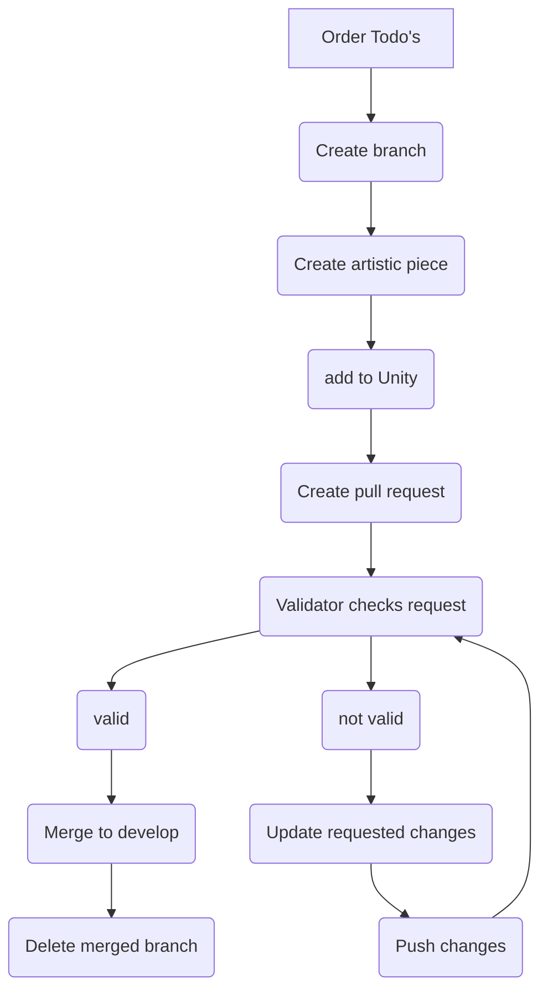

# Art Pipeline

## Components&#x20;

* **3D models:** They're complete with textures, animations, and other elements.
* **2D sprites:** These are made up of all 2D elements, like textures, characters, sprites, and animations in sprite-sheet format.
* **Effects:** This includes all sorts of effects, such as particle systems, VFX, and shaders.

## Software

For 3D modeling, we use [Maya](https://www.autodesk.nl/) and [Blender](https://www.blender.org/), which includes rigging and animation. To texture our 3D models, we make use of [Substance Painter](https://www.adobe.com/products/substance3d-painter.html?sdid=1NZGD5RW\&mv=search\&gclid=Cj0KCQjw27mhBhC9ARIsAIFsETGpL0rKVsQaGcut1laiIaP--rSaINiI4cDZlrxPX6pYyuqnPHFnC84aAsfpEALw\_wcB). In the case of 2D sprites, our preferred software choices are [Clip Studio](https://www.clipstudio.net/en/?gclid=Cj0KCQjw27mhBhC9ARIsAIFsETEp7PYSzK8JSiJXuNme-cA9jOMtntlRZCD4zkkS6ruCynVz9lBnT3oaAt6REALw\_wcB) or [Adobe Animate](https://www.adobe.com/nl/products/animate.html?gclid=Cj0KCQjw27mhBhC9ARIsAIFsETEVNhzxKfu4DGCYOtsIkinq3xqe9SQmtnymgIWa9MoIGmHu6C\_19aoaAnSBEALw\_wcB\&mv=search\&mv=search\&sdid=N7FDRQJF\&ef\_id=Cj0KCQjw27mhBhC9ARIsAIFsETEVNhzxKfu4DGCYOtsIkinq3xqe9SQmtnymgIWa9MoIGmHu6C\_19aoaAnSBEALw\_wcB:G:s\&s\_kwcid=AL!3085!3!600767916168!e!!g!!adobe%20animate!1441877185!60095934641).

## Flow


The process of creating art varies depending on the component, as some require more steps and have a different production method. Therefore, there will be multiple flows for each element.


1. So you know what you are going to make but in what order will you make it? well that varies per component so we will explain per component&#x20;



* What is required for the next step? meaning you can not start texturing the model without a model. you can not animate without a model en so on.&#x20;
* What is the priority? did we add a priority to it in the Trello? or what is considered more important to see in-game for example when creating a door it's more important to open the door than to have a texture on the door.&#x20;
* How long does it take to make? if it only takes 5 minutes to make you can consider doing it first since it won't take much time, especially at the end of the day if you don't have time to start something big.



This is the general order we adhere but it might be different in some instances but that is not a problem!&#x20;

1. Model
2. uv
3. rig
4. weightpaint
5. texture
6. animation



2. Now that you know in what order you will create the art piece(s) we create a branch for it for more detail about creating a branch go to the Gitflow page.
3. Now that you have your branch and the order you will use to create all art piece(s) you can start making them. for each piece, we try to create a separate commit so we don't have massive commits saying "finished everything"  but this is not a requirement for art since it is most likely made in another program&#x20;
4. Now that you created all parts, clean them up so you can pass the review in one go &#x20;
5. Cleaned up and added all necessary files to Unity, time to create a pull request! more information about this can be found in the Gitflow. After creating the pull request your work will be checked by a programmer and artist here is a list of what needs to be checked and by whom. (developer = artist and programmer)&#x20;


Always check the general tab! and if your work fits into one of the components then also check the associated tab if there is no tab for your component no additional things need to be checked or are required&#x20;


#### Requirements&#x20;

these are the 'requirements' we put on our work so that all work is of good quality&#x20;



* Created work should fit the art style
* Are the files an appropriate size, not unnecessarily large?&#x20;
* Are the art files named correctly, following the naming convention found in the style guide?
* Is the art file placed in the correct location in the folder structure, as specified in the style guide
* Is the art file complete, with all necessary components? (to work)
* If the art has transparency, does it work properly?
* Is the file type correct? more info about the type can be found per tab but in general 3d model: fbx, and sprite / texture: png



Model

* Models don't have triangels
* Models like leaves and flowers should be planes, click to see a [bad example](#user-content-fn-1)[^1] and a [good example](#user-content-fn-2)[^2]
* Cylinder / Bol does not have more then 16 sides and 12 for smaller objects&#x20;
* A model can only have one texture.&#x20;
* Models that are made out of multiple models should be merged together.
* all models should be exported as .fbx&#x20;
* Pivot should be in the center there are some exceptions but this is communicated with the group.
* Transform / Rotation / Scale should all be on (0,0,0)

Model texture

* UV has a accurate texel density
* Texture pixcels should be 2048 x 2048 (at least power of 2)
* No smart materials, masks, noise etc. only flatcolor.
* Colors are close to references (saturated and or colorful)&#x20;
* Roughness of all layers should be set to 1
* Texture export should be&#x20;
  * Basecolor
  * Transparence (optional)\




#### Validation

this is what we will validate during the review of the pull request this does not mean we will never check all other parts but these are the things we actively check&#x20;



* FileType&#x20;
* FileSize
* FileNaming



6. Your work has been checked. if there were no problems the validator will merge the branch with the develop branch and delete it. if there were problems these have to be changed before  it will be merged all requested changes can be found in a 'review' within GitHub note that after changing the pull request will need to be checked again.&#x20;

[^1]:  (1) (1).png>)

[^2]:  (1) (1).png>)
