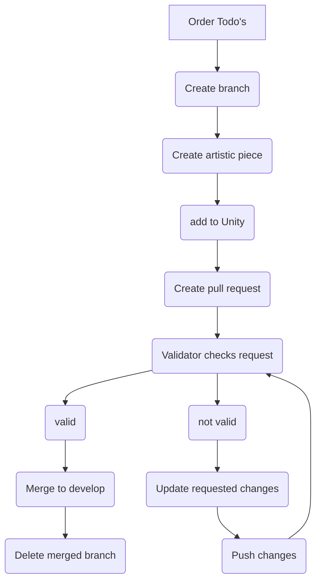

# Art Pipeline

## Components&#x20;

* **3D models:** They're complete with textures, animations, and other elements.
* 2**D sprites:** These are made up of all 2D elements, like textures, characters, sprites, and animations in sprite-sheet format.
* **Effects:** This includes all sorts of effects, such as particle systems, VFX, and shaders.

## Software

For 3D modeling, we use [Maya](https://www.autodesk.nl/) and [Blender](https://www.blender.org/), which includes rigging and animation. To texture our 3D models, we make use of [Substance Painter](https://www.adobe.com/products/substance3d-painter.html?sdid=1NZGD5RW\&mv=search\&gclid=Cj0KCQjw27mhBhC9ARIsAIFsETGpL0rKVsQaGcut1laiIaP--rSaINiI4cDZlrxPX6pYyuqnPHFnC84aAsfpEALw\_wcB). In the case of 2D sprites, our preferred software choices are [Clip Studio](https://www.clipstudio.net/en/?gclid=Cj0KCQjw27mhBhC9ARIsAIFsETEp7PYSzK8JSiJXuNme-cA9jOMtntlRZCD4zkkS6ruCynVz9lBnT3oaAt6REALw\_wcB) or [Adobe Animate](https://www.adobe.com/nl/products/animate.html?gclid=Cj0KCQjw27mhBhC9ARIsAIFsETEVNhzxKfu4DGCYOtsIkinq3xqe9SQmtnymgIWa9MoIGmHu6C\_19aoaAnSBEALw\_wcB\&mv=search\&mv=search\&sdid=N7FDRQJF\&ef\_id=Cj0KCQjw27mhBhC9ARIsAIFsETEVNhzxKfu4DGCYOtsIkinq3xqe9SQmtnymgIWa9MoIGmHu6C\_19aoaAnSBEALw\_wcB:G:s\&s\_kwcid=AL!3085!3!600767916168!e!!g!!adobe%20animate!1441877185!60095934641).

## Flow

1. .&#x20;

