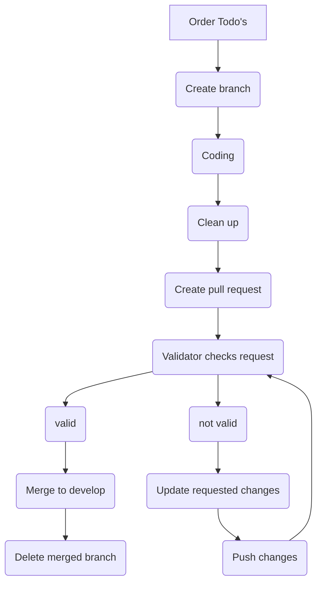

# Scripts Pipeline

## Components&#x20;

* **User Interface (UI)**: This includes all aspects of the interface that the user interacts with, such as menus, buttons, layouts, text, and feedback for actions like pop-ups.
* **Game Mechanics**: This includes all the rules, systems, and mechanisms that define the gameplay, such as movement, physics, score tracking and progression, and sound player.&#x20;
* **Tools**: these are programs or tools used to create or modify the game. This includes, for example, grid editor, scripting tools (such as method extensions), texture and model editors, and so on.&#x20;
* **Artificial Intelligence (AI)**: This includes all aspects of the game's AI, such as enemy behavior, pathfinding, decision-making, and non-player character (NPC) interactions.

## Software

For code in Unity we always use [<mark style="color:blue;">Jetbrain rider</mark>](https://www.jetbrains.com/rider/) but if we need to make something outside of Unity we use [<mark style="color:blue;">Visual Studio Code</mark>](https://code.visualstudio.com/) <mark style="color:blue;"></mark>&#x20;

## Flow


For the following we assume that the programmer has already chosen a user-story and has all todo's &#x20;


1. So you have your todo's but in what order will you create all components? that is a difficult question since it varies but when choosing the order we take the following into consideration
   * What are the script connections (the AI can't move to a position in a grid without a grid so you create the grid first then the AI movement)
   * we give all our todo's a priorty so that is the second thing to take in consideration we start with the high priority and work down to low priority.
2. Now that you know in what order you will create the user story we create a branch for it for more detail about creating a branch go to the Gitflow page.
3. Now that you have your branch and the order you will use to create all components you start coding! for each part, we try to create a separate commit so we don't have massive commits saying "finished everything" &#x20;
4. You coded everything you wanted for this user-story the next step is going over it and doing a rough cleanup. remove used code, remove some script connections that should not be, fix all naming to use the code naming conventions etc.. the most important part of this cleanup is making it so another develop can clearly see what is what and its usage.
5. Cleaned up the code and you are happy with it now it's time to create a pull request more information about this can be found in the Gitflow. After creating the pull request you work will be checked by another programmer (at least someone with coding experience) where the following will be checked.
   * Is the code readable? Can I see what is happening without going in-depth&#x20;
   * do all classes have a single responsibly?
   * Does the code adhere to the style guide?
   * Classes should not be more than 300 lines of code (excluding empty getter - setters, and variable declaration) this is not a must but in general, if it's more than 300 lines it could've been split into separate classes.
6. The code has been checked. if there were no problems the validator will merge the branch with the develop branch and delete it. if there were problems these have to be changed before  it will be merged all requested changes can be found in a 'review' within GitHub note that after changing the pull request will need to be checked again.&#x20;

