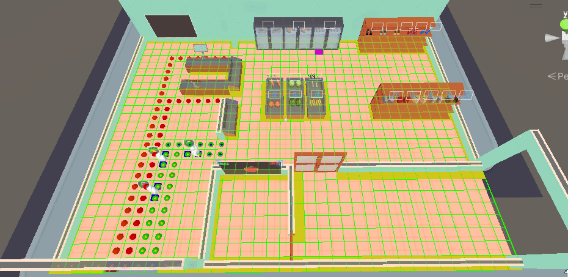

# Emile

> Just a quick note I've worked on more than just this. but these are the ones most worth mentioning.

## 1. Customers&#x20;

### 1.1 PathFinding + Grid

Technical Design:


[customer-pathing.md](../technical-design/customer/customer-pathing.md)


Github PathFinding:



Github Grid:



#### grid

Grid is a class that allows us to create 3d / 2d grids in the world it also has some gizmos that allows us to few the grid and see if it is at the right position by giving and offset (offset is from 0,0) or by setting the cell size it works stand alone and does not require any other scripts outside of the grid folder&#x20;

<figure><figcaption></figcaption></figure>

#### PathFinding

Pathfinding is an extension from grid it allows us to create or calculate paths on the grid and returns a Path object (a list of grid nodes) this can than be used by anyone that knows of it for whatever it wants.  &#x20;

<figure><figcaption></figcaption></figure>

### 1.2 States

Technical design:&#x20;


[customer-states.md](../technical-design/customer/customer-states.md)


Github:



#### Customer States

The customers are a vital part of the game but they also have a lot of different states they can be in, so I created a sort 'statemachine' that triggers state logic giving us the ability make a lot of states for the customers and having them do different things depending on the situation&#x20;

## 2. Player

### 2.1 PlayerInputActions + Connecting (coop)&#x20;

Github (mutliple player prefabs + spawn locations):



Github (Action map):



Github (ResolverIterator):&#x20;



#### PlayerInputActions

PlayerInputActions is just the ActionMap created by unitys latest input system nothing all to big but a big part in our coop games since it allowed us to link controllers or keyboards to a input script so we could have multiple players.

#### PlayerInputManagerExtensions

We used the PlayerInputManager to handle devices connecting and spawning a prefab but unities script doesn't allow for spawn locations or multiple prefabs to be spawned so I created the PlayerInputManagerExtensions that does 2 things it allows us to spawn multiple player prefabs and allows us to give spawn locations&#x20;

### 2.2 PlayerAnimation

Technical Design:


[animations.md](../technical-design/player/animations.md)


#### PlayerAnimations (ragdoll with animator)&#x20;

Since we used a ragdoll player we couldn't simply use the animator to animate the player so a solution to this is creating a copy of the player and copy the rotation from that copy to the ragdoll target rotation, allowing us to the animator to animate ragdoll&#x20;

### 2.3 ResolverIterator

The ResolerIterator on its own is nothing special but in this case its now about the script but more about its function. so.. the players had a lot of problems mostly with stretching when moving to fast or when grabbing a object that is to heavy or having force to the opposite direction you want to walk and we had a hard time fixing it and than we found out we could just update the rigidbody ResolverIterator to a higher number and this fixed the issue!&#x20;

so its not about the script but all the hard work we put in to fixing the ragdoll stretching even tough the solution was so simple.&#x20;

## 3. Tools

### 3.1 Method Extensions

Github:



#### Method Extension

We added a ton of method extensions previously created or even new ones during the development this greatly sped up the process of creating certain scripts one method extension is not worth mentioning but the amount we have sure is!

### 3.2 MonoSingleton

Github:



#### MonoSingleton

A powerful tool to have but also a great risk and " a lot " of work to set up each time you want to make a singleton, so I created the monosingleton that can be used instead of a monobehaviour and its only use is making a singleton from a monobehaviour so you can think about how to set up the script instead of how to make the singleton&#x20;

