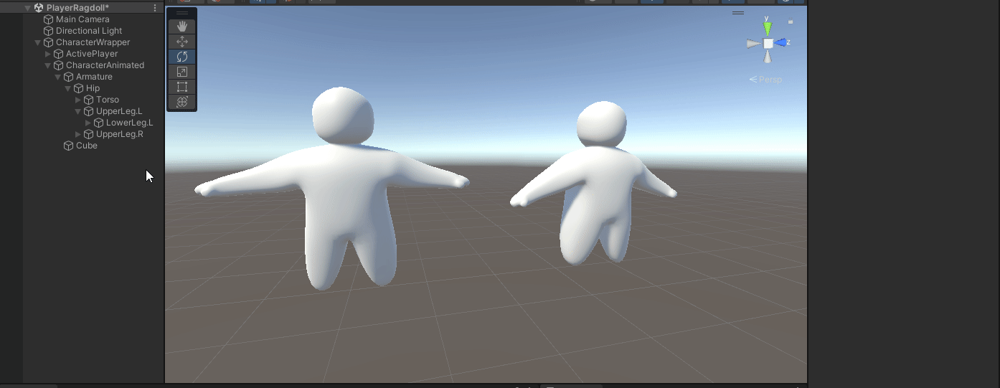

# Customer Pathing

## What we want

For our customers we had one 'main' goal go from your current position to the given position and if you are there trigger an event saying 'pathing finished' so we can then change the state of the customer&#x20;

## How we've done it.

So we went for a grid pathfinding for 2 reasons

1. easier to program and do some tricks with it&#x20;
2. time since we had limit time a grid is one of the faster ways to get pathing&#x20;

but now we have a grid not really any pathing yet so what pathing did we use? well let me let you! we went for 2 pathfinding types a fixed path and A\* pathing why 2 you ask? simply put fixed pathing is faster to make and A\* is better when the position can change by other factors besides customer movement (just following the path) since we can re-calculate it at any time from any point of the grid.&#x20;

now I have to say having 2 pathing systems gave a lot of problems and conflicts at a later point we didn't foresee but luckily it didn't take more than a day to fix&#x20;

### What is a grid and how does it work?

Before I can explain how the pathing works I need to give some more information about what a grid is and how it works.&#x20;

simply put a grid is where x,y,z values are matched to an integer. Take the image as an example where the top (0,1,2) is considered the x and the side (0,1,2,3) is considered the y and if there was depth it would be considered the z but for simplicity, we keep it at a 2d array \
.png>)&#x20;

Now what is so nice about having a grid where we can match x,y values to an integer and the other way around&#x20;

simply put its great for navigation! if we want to move from node 10 to node 3 we can go from 10 -> 11 -> 12 -> 9 -> 6 -> 3 as an index and convert it to world positions (0,3) -> (1,3) -> (2,3) -> (2,2), -> (2,1), -> (2,3) now these x,y values are something we can let the customer move over since its a question of adding or removing a speed value from the customers position until it reached or is close enough to the grid position so it can go to the next and next until it reached the end and if it reached the end we also know so we can trigger methods or events&#x20;

### Fixed Path

What is fixed pathing and how does it work?&#x20;

simply put a fixed path is a list of indexes to follow and since we can convert an index to a world position we can simply move the customer closer and closer over time until it reached it.&#x20;

### A\* Path

What is an A\* path and how does it work?&#x20;

the return value of a\* is the same as a fixed path beside the fact that a fixed path is pre-defined and a-star will calculate the fastest path from one position to the requested position on the grid&#x20;

how does a-star calculate the path

The A-star algorithm calculates the fastest path by starting at the beginning position and getting all neighbors (all nodes that are right next to it). It then checks how far away each neighbor is from the end point and gives each node a distance value. The algorithm then takes the node that is closest to the end position and repeats the process of getting all neighbor nodes and checking their distance values. It updates the distance value and repeats until there are no cells left for the grid to move over or it reaches its position. If the pathfinding reaches the destination, it can backtrack its movements and add them to a list. This list is the path that the customer can follow to reach their destination.

## Some problems we predict(ed)&#x20;

We only predicted 2 major problems and that is the customers now know of eachother and just moving making them collide and even break.

we fixed this by temp-blocking nodes meaning if a customer is using a node or is standing on a node it gets blocked and all other customers have to wait before they can walk over it or they can walk around it.&#x20;

The second problem we predicted had something to do with the previous solution. Customers would wait forever when they wanted the node the other customer was standing on. We did not fix this since we unfortunately didn’t have time for it. But if we had to fix it, we would give all customers a “power level” for each customer that spawns. The power level increases so the first customer’s power level is 1 and the second is 2 and so on.

The next step would be to have a connection between the customers. We can do this by adding an ID to the node saying “custom#232 claimed node 2” and so on. Then we can get the other customer and ask “Do you want my node?” If the answer is yes, we take the one with the highest power level and recalculate its path and block the node it originally wanted to go after recalculating. Its power level will drop down to the lowest level to prevent a lot of customers from still getting stuck because the highest power level customer is surrounded on all sides.

## Our scripts

All grid related scripts can be found on our github under the 'scripts/runtime/grid' folder\
[https://github.com/EmileDavidson/Examen/tree/develop/ExamenProeveUnity/Assets/Scripts/Runtime/Grid](https://github.com/EmileDavidson/Examen/tree/develop/ExamenProeveUnity/Assets/Scripts/Runtime/Grid)\
\
