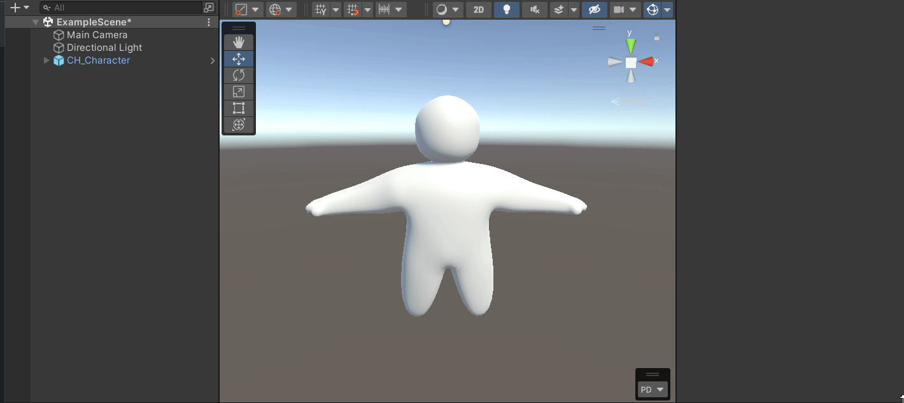
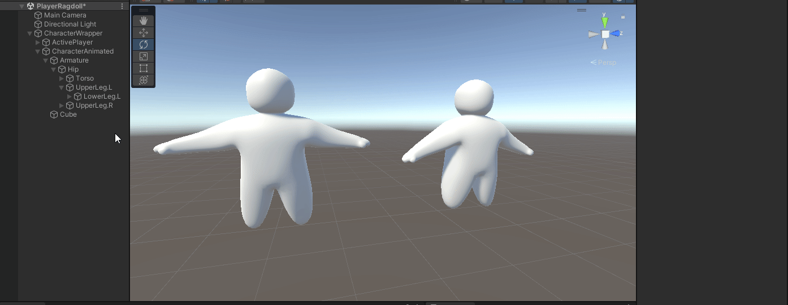

# Animations

## The problem(s)

How do you animate an ragdoll but also keep it use physics when colliding partly and or when a part of its body is connected to an object in the world.&#x20;

You can't just use the animator to animate it directly since it will not care about physics and or it will try to get back to its target rotation, position set on the joint or animating using script saying 'shoulder rotation go to this and upper arm go to this rotation' would take to long to do&#x20;

## Our Solution(s)

The solution we came up with is creating 2 characters inside of a 'wrapper' on character for the ragdoll and one for the animations this is basicly the same as the ragdoll character minus the joints and or controller scripts and is only used to animate using the animator + animator clips&#x20;

> Only the ActivePlayer can be seen in the game itself the AnimatedPlayer can not been seen (the renderer is disabled) and also does not interact with the world so it does not have a rigidbody, or any controller script attached to it&#x20;

```
CharacterWrapper
├── ActiveCharacter
└── AnimatedCharacter 
```

## Guide


This guide does not contain creating a valid model or ragdoll settings but will only explain the steps + scripts on how to use the animator for a ragdoll character so it still interacts with the world&#x20;


### Step 1

The first step would be to create the wrapper and animated character and the ragdoll character this is quite simple to do&#x20;

1. Create an empty GameObject named 'CharacterWrapper'
2. Now drag your CharacterModel in it an call it 'CH\_Character'&#x20;
3. Copy the 'CH\_Character' and call the copy 'CH\_CharacterAnimated'
4. If the character was not already a ragdoll add ConfigurableJoints to all parts of the model if it was already a ragdoll remove all rigidbody's and ConfigurableJoints from the CH\_CharacterAnimated&#x20;

this is the basic setup now you can create a prefab from this wrapper  so it can be re-used since the CH\_CharacterAnimated object will be linked to the CH\_Character that are under the same wrapper.&#x20;

<figure><figcaption></figcaption></figure>

### Step 2

The Next step would be to copy the rotation from the AnimatedCharacter to the TargetRotation of the ActiveCharacter ConfigurableJoints we do this by creating a script that takes a target transform and put it on all character parts containting ConfigurableJoints this script will then set the TargetRotation of the ConfigurableJoint to the rotation of the AnimatedCharacters Transforms part&#x20;


Note that you can not simply set the TargetRotation to the transform value but you need to Inverse to TargetLimbs rotation and multiply it to the start rotation of your ragdoll body part.


&#x20;I will not go too in-depth but just know that it has something to do with world space and local space


#### Script to copy transform to TargetRotation:

<pre class="language-csharp"><code class="lang-csharp"><strong>    public class CopyLimb : MonoBehaviour
</strong>    {
        [SerializeField] private Transform targetLimb;
    
        private ConfigurableJoint _configurableJoint;
        private Quaternion _targetInitialRotation;
        
        void Start()
        {
            _configurableJoint = GetComponent&#x3C;ConfigurableJoint>();
            _targetInitialRotation = targetLimb.transform.localRotation;
        }

        private void FixedUpdate() {
            _configurableJoint.targetRotation = CopyRotation();
        }

        private Quaternion CopyRotation() {
            return Quaternion.Inverse(targetLimb.localRotation) * _targetInitialRotation;
        }
    }
</code></pre>

### Step 3

The last step would be to check if it is working try clicking play in the unity editor and rotating one or more body parts of the animated character if everything is working correctly this should show the rotation being copied to the active character now you can animate your character by rotation. &#x20;

<figure><figcaption></figcaption></figure>


